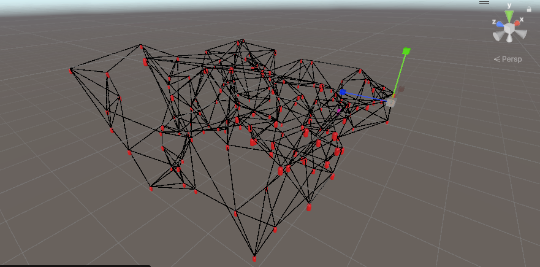
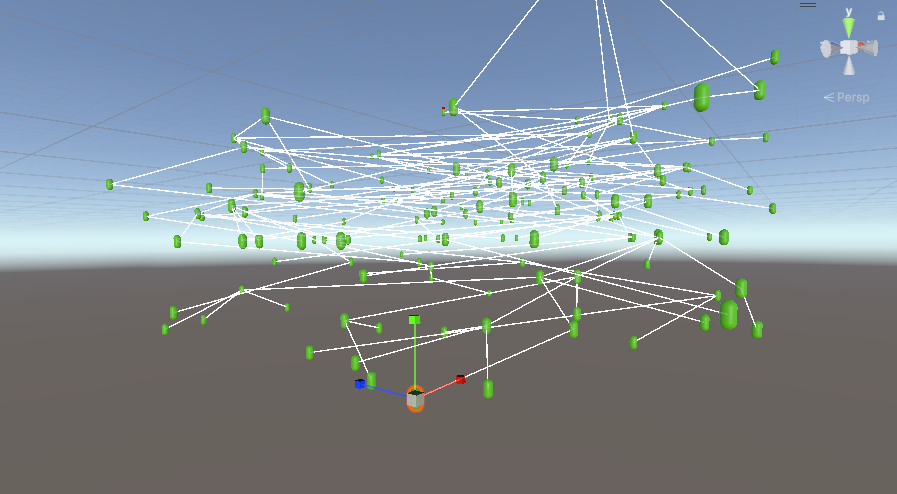

AtomNetworkingSimulator started from a gossip protocol simulation. 
This small project is a research and educationnal project about graph theory and decentralized networks.

- The first goal was to be able to visualize and debug decentralized/async computations in a graph network of nodes, like gossip communications, broadcasts, voting/consensus, and so on..
- The second goal was to find a N-Tree graph optimization algorithm that allows all the nodes of the network to be organized in a n-tree to allow fast and reliable communications with the least number of messages possible.
- The third goal was to test this protocol to allow simulated 'players' in a 3D scene to be connected to peers related to their distance in the virtual world. It would allow a multiplayer open-world game to be fully decentralized, with no main server instance.

Computed N-Tree example (N = 3)

